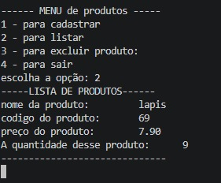

# cadprodutos.py

Programa de Cadastro de Pessoas

O programa de Cadastro de Pessoas foi desenvolvido para armazenar e organizar informações de usuários de forma simples e eficiente. Nele, é possível cadastrar dados como nome, idade, telefone, e-mail e outras informações necessárias.

O sistema recebe os dados digitados pelo usuário, verifica se as informações foram preenchidas corretamente e as registra em uma lista, banco de dados ou arquivo. Após o cadastro, os dados podem ser consultados, alterados ou removidos conforme a necessidade.

Esse tipo de programa é muito utilizado em empresas, escolas, clínicas e comércios para manter o controle das informações das pessoas cadastradas. Durante o desenvolvimento, são aplicados conceitos importantes da programação, como entrada e saída de dados, variáveis, estruturas condicionais, laços de repetição, listas e funções.

